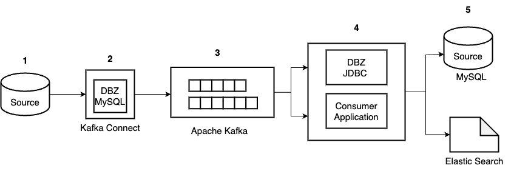

### CDC Service for MySQL
### Overview 



### Prerequisite

##### 1. Install 
- [Docker](script/install_docker.sh)
- [Docker Compose](script/install_docker_compose.sh)

##### 2. MySQL Config
| Property          | Expected Value | Verification SQL Statement                  |
|-------------------|----------------|---------------------------------------------|
| log_bin           | ON             | SHOW VARIABLES LIKE 'log_bin';              |
| binlog_format     | ROW            | SHOW VARIABLES LIKE 'binlog_format';        |
| binlog_row_image  | FULL           | SHOW VARIABLES LIKE 'binlog_row_image';     |

**User**:
- a user has `RELOAD` or `FLUSH_TABLES` privilege(s).

##### 3. Kafka Config
`auto.create.topics.enable` should be true

### How to run
##### 1. Start services
```shell
docker compose up -d
```

##### 2. Create source connector
```shell
curl -i -X POST \
  -H "Accept: application/json" \
  -H "Content-Type: application/json" \
  localhost:8083/connectors/ \
  -d '{
    "name": "source-connector",
    "config": {
      "connector.class": "io.debezium.connector.mysql.MySqlConnector",
      "database.hostname": "mysql",
      "database.port": "3306",
      "database.user": "root",
      "database.password": "123456",
      "database.server.id": "184054",
      "topic.prefix": "mysql",
      "database.include.list": "coffee_shop",
      "schema.history.internal.kafka.bootstrap.servers": "kafka:9092",
      "schema.history.internal.kafka.topic": "schemahistory.coffee_shop"
    }
  }'
```

##### 3. Start consumer
```shell
cd cdc-debezium-consumer
./gradlew run -d
```

### Troubleshooting

##### 1. Check status of Kafka Connect service
```shell
curl -H "Accept:application/json" localhost:8083/
```

##### 2. Check available plugins
```shell
curl -s localhost:8083/connector-plugins
```

##### 3. Check list connectors registered with Kafka Connect
```shell
curl -H "Accept:application/json" localhost:8083/connectors/
```
#### Delete a connector
```shell
curl -X DELETE localhost:8083/connectors/source-connector
```

##### 4. Access the kafka container
```shell
docker exec -it cdc-debezium-consumer-kafka-1 /bin/bash 
cd bin
```

##### 5. List kafka topic
```shell
kafka-topics.sh --list --bootstrap-server localhost:9092
```
